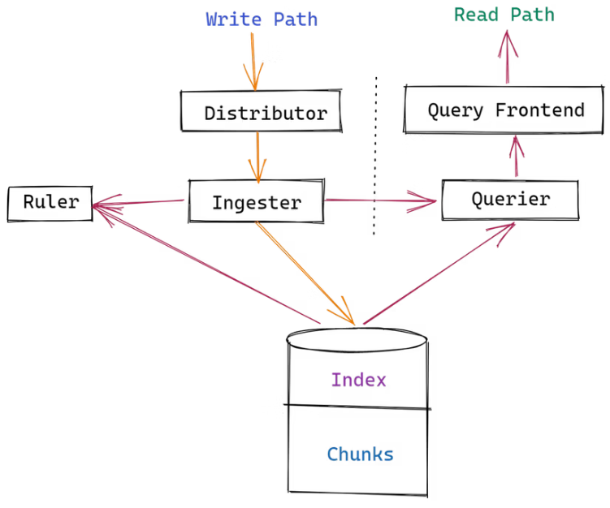
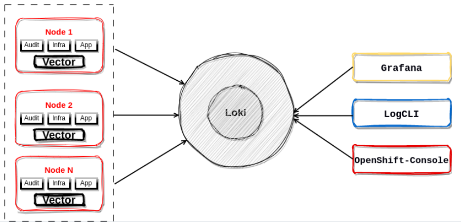

- [openshift-logging-solutions](#openshift-logging-solutions)
  * [Loki Architecture](#loki-architecture)
    + [Loki Components Read and Write Path](#loki-components-read-and-write-path)
    + [Loki Data flow with Vector](#loki-data-flow-with-vector)
  * [Prerequisites](#prerequisites)
  * [OpenShift Logging and Loki Operators](#openshift-logging-and-loki-operators)
    + [Deploy OpenShift Cluster-Logging](#deploy-openshift-cluster-logging)
    + [Deploy loki operator](#deploy-loki-operator)
  * [Create an ObjectBucketClaim in openshift-logging namespace](#create-an-objectbucketclaim-in-openshift-logging-namespace)
  * [Create an Object Storage secret with keys as follows](#create-an-object-storage-secret-with-keys-as-follows)
    + [Create an instance of LokiStack by referencing the secret name and type as s3](#create-an-instance-of-lokistack-by-referencing-the-secret-name-and-type-as-s3)
  * [Create or edit a ClusterLogging CR](#create-or-edit-a-clusterlogging-cr)
  * [Create CLO CLF to forward logs from Loki to Grafana](#create-clo-clf-to-forward-logs-from-loki-to-grafana)
  * [Integrate Loki to Grafana](#integrate-loki-to-grafana)
  * [Final Check Outputs](#final-check-outputs)
  * [Access Grafana gui and console](#access-grafana-gui-and-console)
  * [Query Loki Logs with LogCLI](#query-loki-logs-with-logcli)
  * [Links](#links)

# openshift-logging-solutions
This repository demonstrates how to configure OpenShift Cluster-Logging Stack Vector as a forwarder to LokiStack, using an S3 bucket from OpenShift Data Foundation instead of AWS S3. It also shows how to integrate Loki to Grafana for logs views.

## Loki Architecture 
### Loki Components


### Loki Data flow with Vector


## Prerequisites
In order to install and configure OpenShift Logging the following prerequisites must be met before starting the process.
Determining the supported Openshift Logging release according to the OCP version.

- OCP 4.12+
- OpenShift Logging subsystem v5.4+ but recommended to use v5.7+  
  Due to following features are enabled only on v5.7+ such as Syslog RFC3164, Syslog RFC5424 and HTTP  
- Check for Network requirements before starting, some specific ports must be accessible.
- OpenShift ODF is installed for Loki logging solution if AWS S3 is not used

## OpenShift Logging and Loki Operators
### Deploy OpenShift Cluster-Logging
- Create CLO Namespace  
01_clo_client_ns.yaml:
```yaml
apiVersion: v1
kind: Namespace
metadata:
  name: openshift-logging 
  annotations:
    openshift.io/node-selector: ""
  labels:
    openshift.io/cluster-monitoring: "true"
```
```shellSession
$ oc apply -f 01_clo_client_ns.yaml
```
- Create CLO OperatorGroup 
02_clo_client_og.yaml:
```yaml
apiVersion: operators.coreos.com/v1
kind: OperatorGroup
metadata:
  name: cluster-logging
  namespace: openshift-logging
spec:
  targetNamespaces:
    - openshift-logging
```
```shellSession
$ oc apply -f 02_clo_client_og.yaml
```
- Create CLO Subscription   
03_clo_client_subs.yaml:
```yaml
apiVersion: operators.coreos.com/v1alpha1
kind: Subscription
metadata:
  name: cluster-logging
  namespace: openshift-logging 
spec:
  channel: "stable" 
  name: cluster-logging
  source: redhat-operators 
  sourceNamespace: openshift-marketplace
```
```shellSession
$ oc apply -f 03_clo_client_subs.yaml
```

### Deploy loki operator
- **Prerequisites:**
Logging subsystem for Red Hat OpenShift Operator 5.5 and later
Supported Log Store (AWS S3, Google Cloud Storage, Azure, Swift, Minio, OpenShift Data Foundation)

- **Install the Loki Operator Operator:**  
In the OpenShift Container Platform web console, click `Operators → OperatorHub`.
Then choose `Loki operator provided by redhat`.

## Create an ObjectBucketClaim in openshift-logging namespace
loki-bucket-odf.yaml:
```yaml
apiVersion: objectbucket.io/v1alpha1
kind: ObjectBucketClaim
metadata:
  name: loki-bucket-odf
  namespace: openshift-logging
spec:
  generateBucketName: loki-bucket-odf
  storageClassName: openshift-storage.noobaa.io
```
```shellSession
$ oc apply -f loki-bucket-odf.yaml
$ oc -n openshift-logging get obc
NAME              STORAGE-CLASS                 PHASE   AGE
loki-bucket-odf   openshift-storage.noobaa.io   Bound   26s
```

## Create an Object Storage secret with keys as follows
- Get bucket properties from the associated ConfigMap
```shellSession
BUCKET_HOST=$(oc get -n openshift-logging configmap loki-bucket-odf -o jsonpath='{.data.BUCKET_HOST}')
BUCKET_NAME=$(oc get -n openshift-logging configmap loki-bucket-odf -o jsonpath='{.data.BUCKET_NAME}')
BUCKET_PORT=$(oc get -n openshift-logging configmap loki-bucket-odf -o jsonpath='{.data.BUCKET_PORT}')
```
- Get bucket access key from the associated Secret
```shellSession
ACCESS_KEY_ID=$(oc get -n openshift-logging secret loki-bucket-odf -o jsonpath='{.data.AWS_ACCESS_KEY_ID}' | base64 -d)
SECRET_ACCESS_KEY=$(oc get -n openshift-logging secret loki-bucket-odf -o jsonpath='{.data.AWS_SECRET_ACCESS_KEY}' | base64 -d)
```
- start create lokstack secret
```shellSession
$ oc create -n openshift-logging secret generic lokistack-dev-odf \
  --from-literal=access_key_id="${ACCESS_KEY_ID}" \
  --from-literal=access_key_secret="${SECRET_ACCESS_KEY}" \
  --from-literal=bucketnames="${BUCKET_NAME}" \
  --from-literal=endpoint="https://${BUCKET_HOST}:${BUCKET_PORT}"
```
```shellSession
$ oc -n openshift-logging get secret
NAME                                       TYPE                                  DATA   AGE
loki-bucket-odf                            Opaque                                2      34s
```
**Note**: lokistack-dev-odf is the secret name. The values for ACCESS_KEY_ID, SECRET_ACCESS_KEY, BUCKET_NAME, BUCKET_HOST 
      and BUCKET_PORT are taken from your ObjectBucketClaim's accompanied secret and ConfigMap.

### Create an instance of LokiStack by referencing the secret name and type as s3
loki-stack-cr.yaml:
```yaml
apiVersion: loki.grafana.com/v1
kind: LokiStack
metadata:
  name: logging-loki
  namespace: openshift-logging
spec:
  size: 1x.small
  storage:
    secret:
      name: lokistack-dev-odf
      type: s3
    tls:
      caName: openshift-service-ca.crt
  storageClassName: ocs-storagecluster-cephfs
  tenants:
    mode: openshift-logging
```
```shellSession
$ oc apply -f loki-stack-cr.yaml
$ oc -n openshift-logging get po
NAME                                           READY   STATUS    RESTARTS   AGE
cluster-logging-operator-9c84fd6bd-b8mkn       1/1     Running   0          80m
collector-6sznz                                2/2     Running   0          56m
collector-847nr                                2/2     Running   0          81s
collector-85v9j                                2/2     Running   0          56m
collector-djtqn                                2/2     Running   0          56m
collector-fsgpr                                2/2     Running   0          56m
collector-g8qtd                                2/2     Running   0          56m
logging-loki-compactor-0                       1/1     Running   0          60m
logging-loki-distributor-5596dd66d7-tjm7k      1/1     Running   0          60m
logging-loki-distributor-5596dd66d7-z8sgn      1/1     Running   0          60m
logging-loki-gateway-6956b49cc9-852vf          2/2     Running   0          60m
logging-loki-gateway-6956b49cc9-lk667          2/2     Running   0          60m
logging-loki-index-gateway-0                   1/1     Running   0          60m
logging-loki-index-gateway-1                   1/1     Running   0          60m
logging-loki-ingester-0                        1/1     Running   0          60m
logging-loki-ingester-1                        1/1     Running   0          59m
logging-loki-querier-6597bfb687-hj8lv          1/1     Running   0          60m
logging-loki-querier-6597bfb687-jkdl8          1/1     Running   0          60m
logging-loki-query-frontend-759465798d-drntm   1/1     Running   0          60m
logging-loki-query-frontend-759465798d-tz9vz   1/1     Running   0          60m
logging-view-plugin-5f95bdb9ff-9n6rj           1/1     Running   0          75m
```

## Create or edit a ClusterLogging CR
Update CLO CR logStore type to `lokistack and collection to `vector`

cluster-clo-vector-cr.yaml:
```yaml
apiVersion: logging.openshift.io/v1
kind: ClusterLogging
metadata:
  name: instance
  namespace: openshift-logging
spec:
  managementState: Managed
  logStore:
    type: lokistack
    lokistack:
      name: logging-loki
  collection:
    type: vector
```
```shellSession
$ oc apply -f cluster-clo-vector-cr.yaml
```

## Create CLO CLF to forward logs from Loki to Grafana
**Note:** loki logs can be viewed fron OpenShift Console by default, so there is no need to have extra steps but to view logs from grafana from loki.grafana.com.
      These following steps are required to integrate Loki to Grafana. 

- Create lokistack-gateway-bearer-token  
```shellSession
$ oc -n openshift-logging create secret generic lokistack-gateway-bearer-token \
  --from-literal=token="$(oc -n openshift-logging get secret logcollector-token --template='{{.data.token | base64decode}}')"  \
  --from-literal=ca-bundle.crt="$(oc -n openshift-logging get configmap openshift-service-ca.crt --template='{{index .data "service-ca.crt"}}')"
```

For details of Loki `retention` and `storage-size` click the following [Loki Retention](https://docs.openshift.com/container-platform/4.12/logging/cluster-logging-loki.html#logging-loki-retention_cluster-logging-loki)
And [Loki storage size](https://docs.openshift.com/container-platform/4.12/logging/cluster-logging-loki.html#deployment-sizing_cluster-logging-loki)

- Start Create ClusterLoggingForwarder as loki type  
create-clf-loki.yaml:
```yaml
apiVersion: logging.openshift.io/v1
kind: ClusterLogForwarder
metadata:
  name: instance
  namespace: openshift-logging
spec:
  outputs:
   - name: loki-app
     type: loki
     url: https://logging-loki-gateway-http.openshift-logging.svc:8080/api/logs/v1/application
     secret:
       name: lokistack-gateway-bearer-token
   - name: loki-infra
     type: loki
     url: https://logging-loki-gateway-http.openshift-logging.svc:8080/api/logs/v1/infrastructure
     secret:
       name: lokistack-gateway-bearer-token
   - name: loki-audit
     type: loki
     url: https://logging-loki-gateway-http.openshift-logging.svc:8080/api/logs/v1/audit
     secret:
       name: lokistack-gateway-bearer-token
  pipelines:
   - name: send-app-logs
     inputRefs:
     - application
     outputRefs:
     - loki-app
   - name: send-infra-logs
     inputRefs:
     - infrastructure
     outputRefs:
     - loki-infra
   - name: send-audit-logs
     inputRefs:
     - audit
     outputRefs:
     - loki-audit
```
## Integrate Loki to Grafana
grafana-loki-integration.yaml:
```yaml
apiVersion: v1
kind: ServiceAccount
metadata:
  annotations:
    serviceaccounts.openshift.io/oauth-redirectreference.grafana: '{"kind":"OAuthRedirectReference","apiVersion":"v1","reference":{"kind":"Route","name":"grafana"}}'
  name: grafana
  namespace: openshift-logging
---
apiVersion: rbac.authorization.k8s.io/v1
kind: ClusterRole
metadata:
  name: logging-logs-reader
rules:
- apiGroups:
  - loki.grafana.com
  resourceNames:
  - logs
  resources:
  - application
  - infrastructure
  - audit
  verbs:
  - get
  - create
- apiGroups:
  - ""
  resources:
  - namespaces
  verbs:
  - get
  - list
---
apiVersion: rbac.authorization.k8s.io/v1
kind: ClusterRoleBinding
metadata:
  name: logging-grafana-auth-delegator
roleRef:
  apiGroup: rbac.authorization.k8s.io
  kind: ClusterRole
  name: system:auth-delegator
subjects:
- kind: ServiceAccount
  name: grafana
  namespace: openshift-logging
---
apiVersion: rbac.authorization.k8s.io/v1
kind: ClusterRoleBinding
metadata:
  name: logging-grafana-logs-reader
roleRef:
  apiGroup: rbac.authorization.k8s.io
  kind: ClusterRole
  name: logging-logs-reader
subjects:
- kind: ServiceAccount
  name: grafana
  namespace: openshift-logging
---
apiVersion: v1
data:
  config.ini: |
    [analytics]
    check_for_updates = false
    reporting_enabled = false
    [auth]
    disable_login_form = true
    disable_signout_menu = true
    [auth.basic]
    enabled = false
    [auth.proxy]
    auto_sign_up = true
    enabled = true
    header_name = X-Forwarded-User
    [security]
    admin_user = system:does-not-exist
    cookie_secure = true
    [users]
    viewers_can_edit = true
    default_theme = light
    [log]
    mode = console
kind: ConfigMap
metadata:
  name: grafana-config
  namespace: openshift-logging
---
apiVersion: v1
data:
  loki.yaml: |
    apiVersion: 1
    datasources:
      - name: Loki (Application)
        isDefault: true
        type: loki
        access: proxy
        url: https://${GATEWAY_ADDRESS}/api/logs/v1/application/
        jsonData:
          tlsAuthWithCACert: true
          httpHeaderName1: Authorization
        secureJsonData:
          tlsCACert: ${GATEWAY_SERVICE_CA}
          httpHeaderValue1: Bearer ${GATEWAY_BEARER_TOKEN}
      - name: Loki (Infrastructure)
        type: loki
        access: proxy
        url: https://${GATEWAY_ADDRESS}/api/logs/v1/infrastructure/
        jsonData:
          tlsAuthWithCACert: true
          httpHeaderName1: Authorization
        secureJsonData:
          tlsCACert: ${GATEWAY_SERVICE_CA}
          httpHeaderValue1: Bearer ${GATEWAY_BEARER_TOKEN}
      - name: Loki (Audit)
        type: loki
        access: proxy
        url: https://${GATEWAY_ADDRESS}/api/logs/v1/audit/
        jsonData:
          tlsAuthWithCACert: true
          httpHeaderName1: Authorization
        secureJsonData:
          tlsCACert: ${GATEWAY_SERVICE_CA}
          httpHeaderValue1: Bearer ${GATEWAY_BEARER_TOKEN}
kind: ConfigMap
metadata:
  name: grafana-datasources
  namespace: openshift-logging
---
apiVersion: v1
data:
  prepare-token.sh: |
    #!/usr/bin/env bash

    set -e -u -o pipefail

    bearer_token=$(cat /var/run/secrets/kubernetes.io/serviceaccount/token)
    sed "s/\${GATEWAY_BEARER_TOKEN}/$bearer_token/g" /input/loki.yaml > /output/loki.yaml
kind: ConfigMap
metadata:
  name: grafana-init-scripts
  namespace: openshift-logging
---
apiVersion: v1
kind: Service
metadata:
  annotations:
    service.alpha.openshift.io/serving-cert-secret-name: grafana-tls
  labels:
    app: grafana
  name: grafana
  namespace: openshift-logging
spec:
  ports:
  - name: https
    port: 8443
    protocol: TCP
    targetPort: https
  - name: http-grafana
    port: 3000
    protocol: TCP
    targetPort: http-grafana
  selector:
    app: grafana
  sessionAffinity: None
  type: ClusterIP
---
apiVersion: apps/v1
kind: Deployment
metadata:
  labels:
    app: grafana
  name: grafana
  namespace: openshift-logging
spec:
  selector:
    matchLabels:
      app: grafana
  template:
    metadata:
      labels:
        app: grafana
    spec:
      containers:
      - args:
        - -config=/etc/grafana/config.ini
        env:
        - name: GATEWAY_SERVICE_CA
          valueFrom:
            configMapKeyRef:
              key: service-ca.crt
              name: openshift-service-ca.crt
        - name: GATEWAY_ADDRESS
          value: logging-loki-gateway-http.openshift-logging.svc:8080
        - name: GF_PATHS_PROVISIONING
          value: /var/lib/provisioning
        - name: GF_SECURITY_ADMIN_USER
          value: kube:admin
        image: quay.io/avu0/grafana:8.5.6
        imagePullPolicy: IfNotPresent
        livenessProbe:
          failureThreshold: 3
          initialDelaySeconds: 30
          periodSeconds: 10
          successThreshold: 1
          tcpSocket:
            port: 3000
          timeoutSeconds: 1
        name: grafana
        ports:
        - containerPort: 3000
          name: http-grafana
          protocol: TCP
        readinessProbe:
          failureThreshold: 3
          httpGet:
            path: /robots.txt
            port: 3000
            scheme: HTTP
          initialDelaySeconds: 10
          periodSeconds: 30
          successThreshold: 1
          timeoutSeconds: 2
        resources:
          requests:
            cpu: 250m
            memory: 256Mi
        volumeMounts:
        - mountPath: /etc/grafana
          name: grafana-config
        - mountPath: /var/lib/provisioning/datasources
          name: patched-datasources
        - mountPath: /var/lib/grafana
          name: grafana
        - mountPath: /etc/grafana/provisioning/datasources
          name: grafana-datasources
      - args:
        - -provider=openshift
        - -https-address=:8443
        - -http-address=
        - -upstream=http://localhost:3000
        - -tls-cert=/etc/tls/private/tls.crt
        - -tls-key=/etc/tls/private/tls.key
        - -client-id=system:serviceaccount:openshift-logging:grafana
        - -client-secret-file=/var/run/secrets/kubernetes.io/serviceaccount/token
        - -cookie-secret=ZXhhbXBsZS1jb29raWUtc2VjcmV0enp6
        - -cookie-expire=24h
        - -skip-provider-button
        - -scope=user:info user:check-access user:list-projects
        - -pass-access-token
        env:
        - name: HTTP_PROXY
        - name: HTTPS_PROXY
        - name: NO_PROXY
        image: quay.io/openshift/origin-oauth-proxy:4.10
        imagePullPolicy: IfNotPresent
        name: grafana-proxy
        ports:
        - containerPort: 8443
          name: https
          protocol: TCP
        readinessProbe:
          failureThreshold: 3
          httpGet:
            path: /oauth/healthz
            port: https
            scheme: HTTPS
          periodSeconds: 10
          successThreshold: 1
          timeoutSeconds: 1
        resources:
          requests:
            cpu: 1m
            memory: 20Mi
        terminationMessagePath: /dev/termination-log
        terminationMessagePolicy: File
        volumeMounts:
        - mountPath: /etc/tls/private
          name: secret-grafana-tls
      initContainers:
      - args:
        - /usr/bin/bash
        - -c
        - /scripts/prepare-token.sh
        image: quay.io/avu0/fedora:35
        name: write-bearer-token
        volumeMounts:
        - mountPath: /scripts
          name: grafana-init-scripts
        - mountPath: /input
          name: grafana-datasources
        - mountPath: /output
          name: patched-datasources
      serviceAccountName: grafana
      volumes:
      - configMap:
          name: grafana-config
        name: grafana-config
      - name: secret-grafana-tls
        secret:
          defaultMode: 420
          secretName: grafana-tls
      - configMap:
          defaultMode: 493
          name: grafana-init-scripts
        name: grafana-init-scripts
      - emptyDir: {}
        name: patched-datasources
      - configMap:
          name: grafana-datasources
        name: grafana-datasources
      - emptyDir: {}
        name: grafana
---
apiVersion: route.openshift.io/v1
kind: Route
metadata:
  name: grafana
  namespace: openshift-logging
spec:
  port:
    targetPort: https
  tls:
    insecureEdgeTerminationPolicy: Redirect
    termination: reencrypt
  to:
    kind: Service
    name: grafana
    weight: 100
  wildcardPolicy: None
```
```shellSession
$ oc apply -f grafana-loki-integration.yaml
````

## Final Check Outputs
```shellSession
$ oc -n openshift-logging get route
NAME           HOST/PORT                                                                      PATH   SERVICES                    PORT     TERMINATION          WILDCARD
grafana        grafana-openshift-logging.apps.abi.hubcluster-1.lab.eng.cert.redhat.com               grafana                     https    reencrypt/Redirect   None
logging-loki   logging-loki-openshift-logging.apps.abi.hubcluster-1.lab.eng.cert.redhat.com          logging-loki-gateway-http   public   reencrypt            None

$ oc -n openshift-logging get po
NAME                                           READY   STATUS    RESTARTS   AGE
cluster-logging-operator-9c84fd6bd-b8mkn       1/1     Running   0          80m
collector-6sznz                                2/2     Running   0          56m
collector-847nr                                2/2     Running   0          81s
collector-85v9j                                2/2     Running   0          56m
collector-djtqn                                2/2     Running   0          56m
collector-fsgpr                                2/2     Running   0          56m
collector-g8qtd                                2/2     Running   0          56m
logging-loki-compactor-0                       1/1     Running   0          60m
logging-loki-distributor-5596dd66d7-tjm7k      1/1     Running   0          60m
logging-loki-distributor-5596dd66d7-z8sgn      1/1     Running   0          60m
logging-loki-gateway-6956b49cc9-852vf          2/2     Running   0          60m
logging-loki-gateway-6956b49cc9-lk667          2/2     Running   0          60m
logging-loki-index-gateway-0                   1/1     Running   0          60m
logging-loki-index-gateway-1                   1/1     Running   0          60m
logging-loki-ingester-0                        1/1     Running   0          60m
logging-loki-ingester-1                        1/1     Running   0          59m
logging-loki-querier-6597bfb687-hj8lv          1/1     Running   0          60m
logging-loki-querier-6597bfb687-jkdl8          1/1     Running   0          60m
logging-loki-query-frontend-759465798d-drntm   1/1     Running   0          60m
logging-loki-query-frontend-759465798d-tz9vz   1/1     Running   0          60m
logging-view-plugin-5f95bdb9ff-9n6rj           1/1     Running   0          75m

$ oc -n openshift-logging get pvc
NAME                                   STATUS   VOLUME                                     CAPACITY   ACCESS MODES   STORAGECLASS                AGE
storage-logging-loki-compactor-0       Bound    pvc-5fd76511-dab6-43a5-a58a-dc07c8754477   10Gi       RWO            ocs-storagecluster-cephfs   66m
storage-logging-loki-index-gateway-0   Bound    pvc-50e19daf-7e48-44be-82dc-26955f91ea58   50Gi       RWO            ocs-storagecluster-cephfs   66m
storage-logging-loki-index-gateway-1   Bound    pvc-4d1d782e-b34b-4e0a-bc1e-b968507585fc   50Gi       RWO            ocs-storagecluster-cephfs   65m
storage-logging-loki-ingester-0        Bound    pvc-af55fa48-fad5-404c-8558-ff9062bcd553   10Gi       RWO            ocs-storagecluster-cephfs   66m
storage-logging-loki-ingester-1        Bound    pvc-71009783-4d14-45a1-bbf8-5873cf3d7e57   10Gi       RWO            ocs-storagecluster-cephfs   65m
wal-logging-loki-ingester-0            Bound    pvc-c0e3f02e-24ff-4f0a-b059-3c674408a08c   150Gi      RWO            ocs-storagecluster-cephfs   66m
wal-logging-loki-ingester-1            Bound    pvc-ec32045d-7b89-4f04-8e39-93c877538734   150Gi      RWO            ocs-storagecluster-cephfs   65m
````

## Access Grafana gui and console
OpenShift Console Logs:  
https://console-openshift-console.apps.abi.hubcluster-1.lab.eng.cert.redhat.com/monitoring/logs

grafana GUI:  
https://grafana-openshift-logging.apps.abi.hubcluster-1.lab.eng.cert.redhat.com/

## Query Loki Logs with LogCLI
- Download and make logcli  
  click [Download LogCLI](https://grafana.com/docs/loki/v2.8.x/tools/logcli/)
  
- Get Loki Bearer Token from secret  
```shellSession
$ oc -n openshift-logging get secret lokistack-gateway-bearer-token  -o jsonpath='{.data.token}' |base64 -d > loki-bearer-token
```
- Get Loki Route
```shellSession
$ oc -n openshift-logging get route
NAME           HOST/PORT                                                                      PATH   SERVICES                    PORT     TERMINATION          WILDCARD
logging-loki   logging-loki-openshift-logging.apps.abi.hubcluster-1.lab.eng.cert.redhat.com          logging-loki-gateway-http   public   reencrypt            None
```
- Start Access Loki Log with LogCLI
```shellSession
$ alias lc='logcli --addr https://logging-loki-openshift-logging.apps.abi.hubcluster-1.lab.eng.cert.redhat.com/api/logs/v1/application --bearer-token-file=loki-token1 --tls-skip-verify'
$ lc labels
2023/08/29 17:14:07 https://logging-loki-openshift-logging.apps.abi.hubcluster-1.lab.eng.cert.redhat.com/api/logs/v1/application/loki/api/v1/labels?end=1693343647702725345&start=1693340047702725345
kubernetes_container_name
kubernetes_host
kubernetes_namespace_name
kubernetes_pod_name
log_type

$ lc query '{log_type="application"}'
$ lc query '{kubernetes_namespace_name="multicluster-engine"}' --tail
```
```json
lc query '{kubernetes_namespace_name="multicluster-engine"}' --output jsonl|jq
{
  "labels": {
    "kubernetes_container_name": "backplane-operator",
    "kubernetes_host": "master-1",
    "kubernetes_pod_name": "multicluster-engine-operator-7459bf675d-5z6rk"
  },
  "line": "{\"@timestamp\":\"2023-08-29T21:16:21.136820483Z\",\"file\":\"/var/log/pods/multicluster-engine_multicluster-engine-operator-7459bf675d-5z6rk_6c10923d-fdfd-4878-a4c1-b0b305708138/backplane-operator/0.log\",\"hostname\":\"master-1\",\"kubernetes\":{\"annotations\":{\"alm-examples\":\"[{\\\"apiVersion\\\": \\\"multicluster.openshift.io/v1\\\", \\\"kind\\\": \\\"MultiClusterEngine\\\", \\\"metadata\\\": {\\\"name\\\": \\\"multiclusterengine\\\"}, \\\"spec\\\": {}}]\",\"capabilities\":\"Seamless Upgrades\",\"categories\":\"Integration & Delivery\",\"certified\":\"true\",\"createdAt\":\"2023-06-12T16:56:48Z\",\"description\":\"Foundational components for central management of multiple OpenShift Container Platform and Kubernetes clusters\",\"k8s.ovn.org/pod-networks\":\"{\\\"default\\\":{\\\"ip_addresses\\\":[\\\"10.128.0.64/23\\\"],\\\"mac_address\\\":\\\"0a:58:0a:80:00:40\\\",\\\"gateway_ips\\\":[\\\"10.128.0.1\\\"],\\\"ip_address\\\":\\\"10.128.0.64/23\\\",\\\"gateway_ip\\\":\\\"10.128.0.1\\\"}}\",\"k8s.v1.cni.cncf.io/network-status\":\"[{\\n    \\\"name\\\": \\\"ovn-kubernetes\\\",\\n    \\\"interface\\\": \\\"eth0\\\",\\n    \\\"ips\\\": [\\n        \\\"10.128.0.64\\\"\\n    ],\\n    \\\"mac\\\": \\\"0a:58:0a:80:00:40\\\",\\n    \\\"default\\\": true,\\n    \\\"dns\\\": {}\\n}]\",\"k8s.v1.cni.cncf.io/networks-status\":\"[{\\n    \\\"name\\\": \\\"ovn-kubernetes\\\",\\n    \\\"interface\\\": \\\"eth0\\\",\\n    \\\"ips\\\": [\\n        \\\"10.128.0.64\\\"\\n    ],\\n    \\\"mac\\\": \\\"0a:58:0a:80:00:40\\\",\\n    \\\"default\\\": true,\\n    \\\"dns\\\": {}\\n}]\",\"olm.operatorGroup\":\"default\",\"olm.operatorNamespace\":\"multicluster-engine\",\"olm.skipRange\":\">=2.2.0 <2.3.0\",\"olm.targetNamespaces\":\"multicluster-engine\",\"openshift.io/scc\":\"restricted-v2\",\"operatorframework.io/initialization-resource\":\"{\\\"apiVersion\\\":\\\"multicluster.openshift.io/v1\\\", \\\"kind\\\":\\\"MultiClusterEngine\\\",\\\"metadata\\\":{\\\"name\\\":\\\"engine\\\"},\\\"spec\\\": {}}\",\"operatorframework.io/properties\":\"{\\\"properties\\\":[{\\\"type\\\":\\\"olm.gvk\\\",\\\"value\\\":{\\\"group\\\":\\\"multicluster.openshift.io\\\",\\\"kind\\\":\\\"MultiClusterEngine\\\",\\\"version\\\":\\\"v1\\\"}},{\\\"type\\\":\\\"olm.package\\\",\\\"value\\\":{\\\"packageName\\\":\\\"multicluster-engine\\\",\\\"version\\\":\\\"2.3.0\\\"}}]}\",\"operatorframework.io/suggested-namespace\":\"multicluster-engine\",\"operators.openshift.io/infrastructure-features\":\"[\\\"disconnected\\\", \\\"proxy-aware\\\", \\\"fips\\\"]\",\"operators.openshift.io/valid-subscription\":\"[\\\"OpenShift Kubernetes Engine\\\", \\\"OpenShift Container Platform\\\", \\\"OpenShift Platform Plus\\\"]\",\"operators.operatorframework.io/internal-objects\":\"[]\",\"seccomp.security.alpha.kubernetes.io/pod\":\"runtime/default\",\"support\":\"Red Hat\"},\"container_id\":\"cri-o://1bebf186695b35978ba2156f0ae06d95e053f79dca51366c2b435992b005cc1c\",\"container_image\":\"registry.redhat.io/multicluster-engine/backplane-rhel8-operator@sha256:411f667cedd34b3bca5ce795b8dd928000a486b98dfc53aabc6c507974b2759e\",\"container_name\":\"backplane-operator\",\"labels\":{\"control-plane\":\"backplane-operator\",\"pod-template-hash\":\"7459bf675d\"},\"namespace_id\":\"ce441e98-0d6e-4147-a24e-704d1414334a\",\"namespace_labels\":{\"kubernetes_io_metadata_name\":\"multicluster-engine\",\"olm_operatorgroup_uid_f23b2ee2-09f9-42fa-8945-cb2c86f49100\":\"\",\"pod-security_kubernetes_io_audit\":\"restricted\",\"pod-security_kubernetes_io_audit-version\":\"v1.24\",\"pod-security_kubernetes_io_warn\":\"restricted\",\"pod-security_kubernetes_io_warn-version\":\"v1.24\"},\"namespace_name\":\"multicluster-engine\",\"pod_id\":\"6c10923d-fdfd-4878-a4c1-b0b305708138\",\"pod_ip\":\"10.128.0.64\",\"pod_name\":\"multicluster-engine-operator-7459bf675d-5z6rk\",\"pod_owner\":\"ReplicaSet/multicluster-engine-operator-7459bf675d\"},\"level\":\"debug\",\"log_type\":\"application\",\"message\":\"2023-08-29T21:16:21.136Z\\tDEBUG\\tcontroller-runtime.webhook.webhooks\\twrote response\\t{\\\"webhook\\\": \\\"/validate-multicluster-openshift-io-v1-multiclusterengine\\\", \\\"code\\\": 200, \\\"reason\\\": \\\"\\\", \\\"UID\\\": \\\"7e158644-7285-4140-b42c-5cef99f7e312\\\", \\\"allowed\\\": true}\",\"openshift\":{\"cluster_id\":\"3059ccb7-ed7a-4ceb-b41f-b9c699d73d00\",\"sequence\":11701}}",
  "timestamp": "2023-08-29T17:16:28.861006731-04:00"
}
```

## Links

Official OpenShift Document for CLO:  
https://access.redhat.com/documentation/en-us/openshift_container_platform/4.12/html/logging/cluster-logging-loki

migration es to loki:
https://access.redhat.com/articles/6991632  

migrate from fluentd to vector:  
https://access.redhat.com/articles/6999658  
https://docs.openshift.com/dedicated/logging/cluster-logging.html#collector-features  
https://vector.dev/docs/about/what-is-vector/  
https://crashlaker.medium.com/which-logging-solution-4b96ad3e8d21  
https://hackernoon.com/grafana-loki-architecture-summary-and-running-in-kubernetes  
https://cloud.redhat.com/blog/whats-new-in-red-hat-openshift-logging-5.5  
